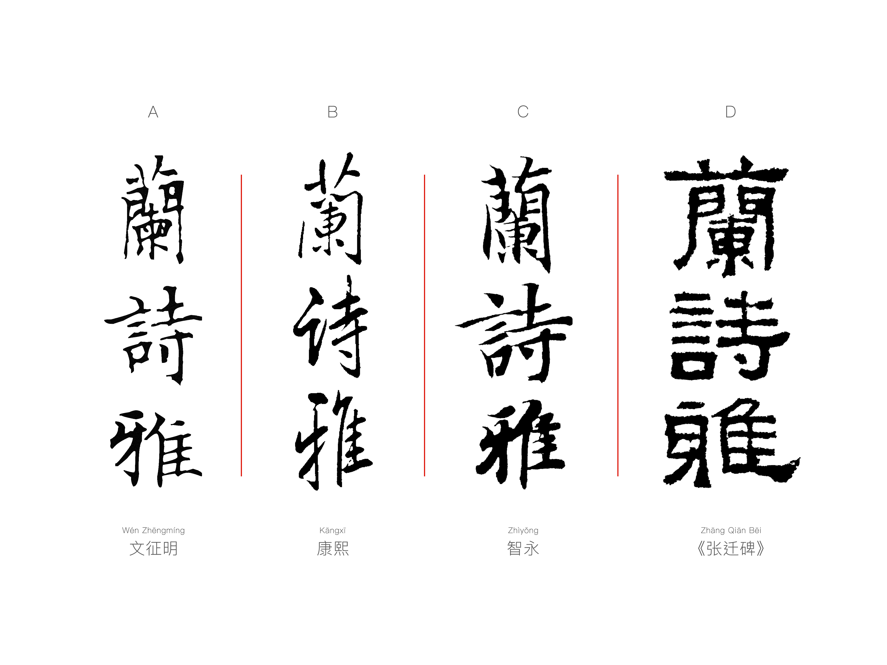
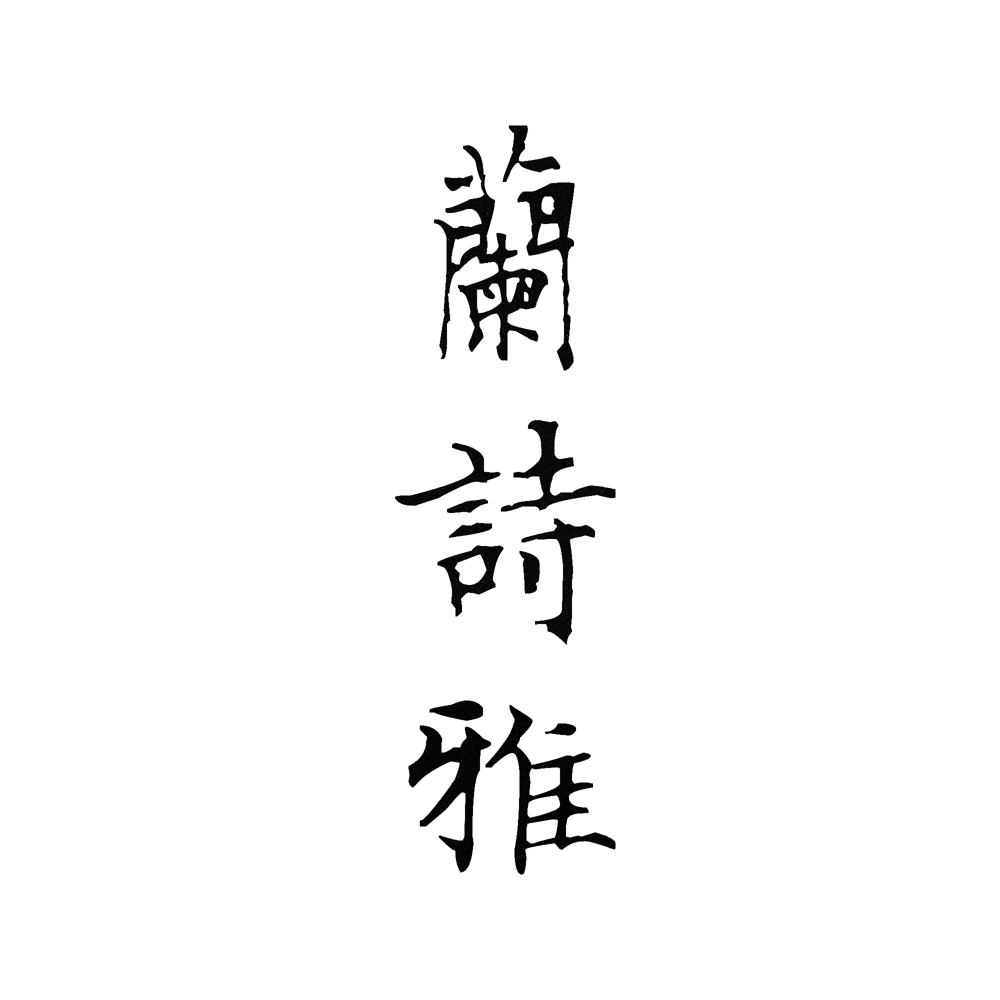
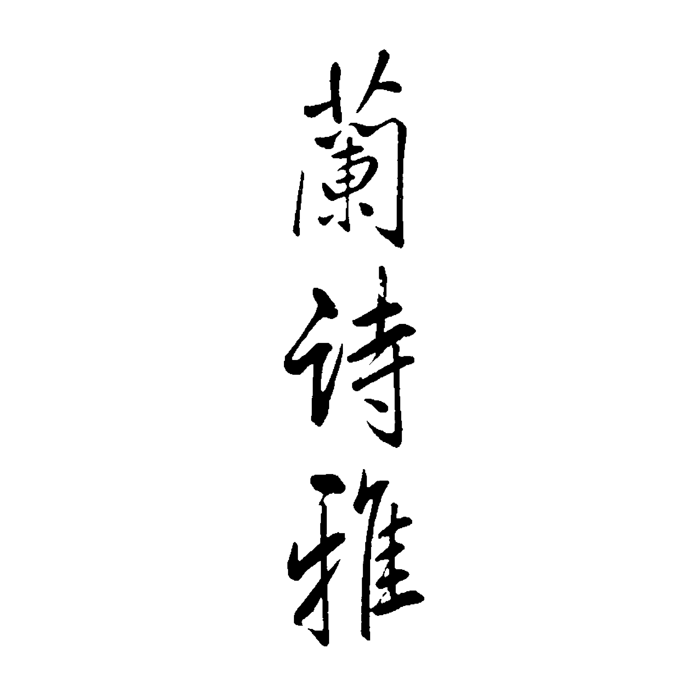
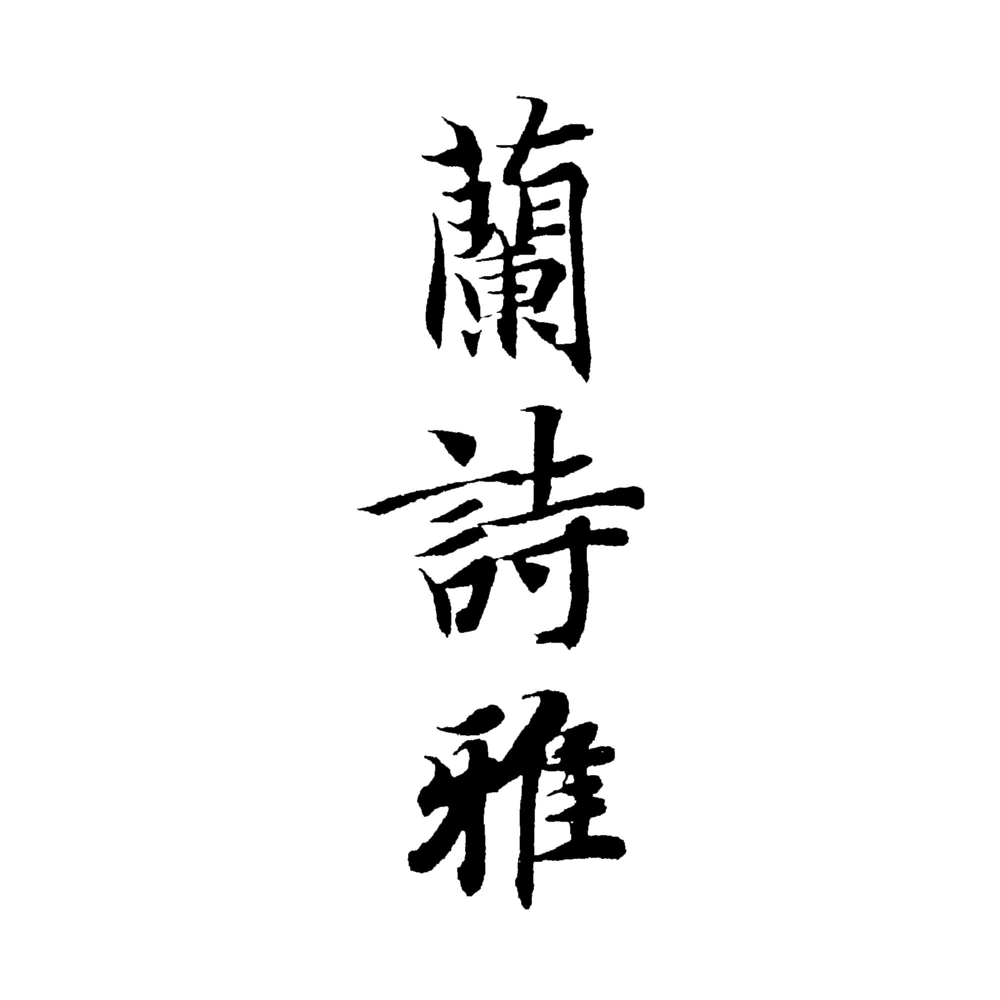
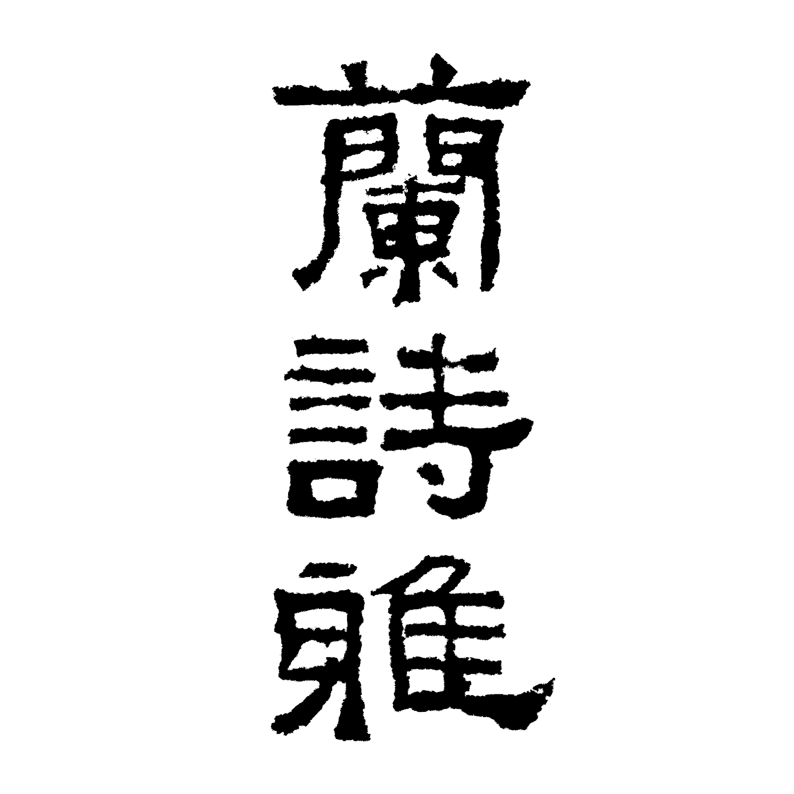

# 「兰诗雅（蘭詩雅）」

A: Written by [**Wen Zhengming** (文征明)](https://en.wikipedia.org/wiki/Wen_Zhengming)

B: Written by [**Kangxi** (康熙) Emperor](https://en.wikipedia.org/wiki/Kangxi_Emperor)

C: Written by [**Zhiyong** (智永)](https://zh.wikipedia.org/wiki/%E6%99%BA%E6%B0%B8)

D: Written by Unknown while the epigraphical artwork is known as [*Zhang Qian Bei* (《张迁碑》)](https://zh.wikipedia.org/wiki/%E5%BC%A0%E8%BF%81%E7%A2%91)

## Wen Zhengming

## Kangxi Emperor

## Zhiyong

## Zhang Qian Bei

